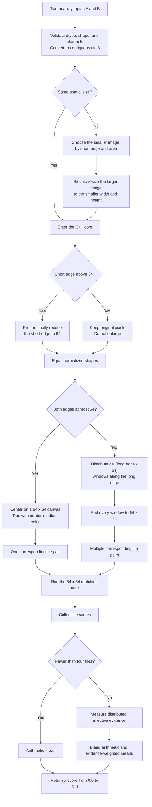
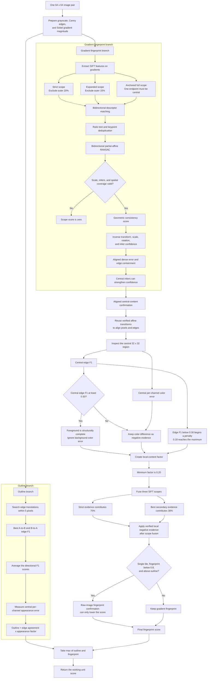
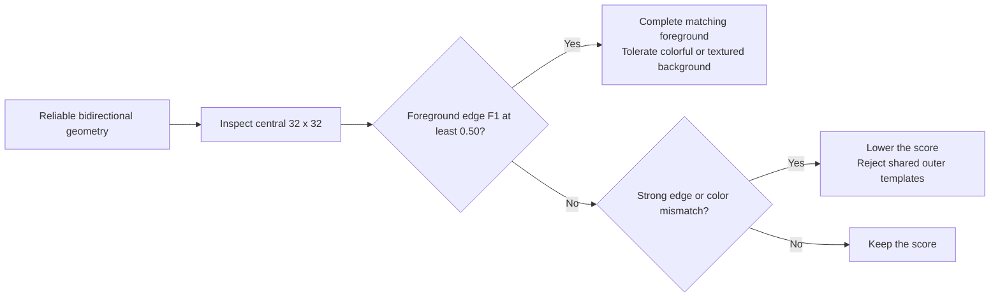
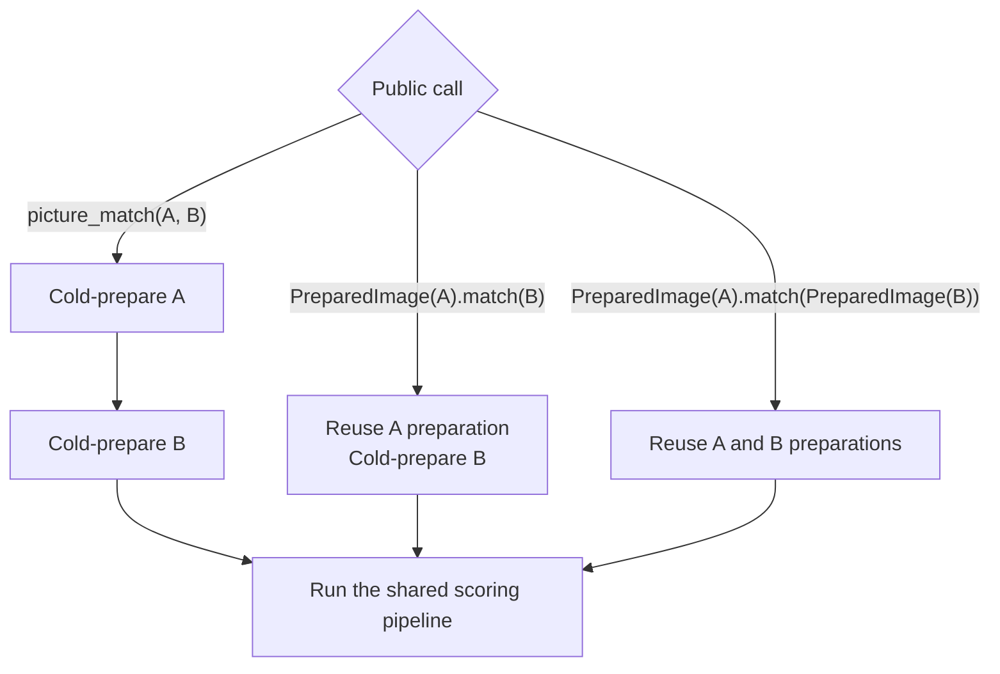

# Matchup matching flowcharts

These diagrams describe the current `matchup` 1.0.8 Python and C++ execution
paths. See [MATCHING_IMPLEMENTATION.md](MATCHING_IMPLEMENTATION.md) for detailed
parameters and design notes.

## End-to-end flow

## One 64 x 64 working unit

## Central-content decision

## Cold and prepared paths

